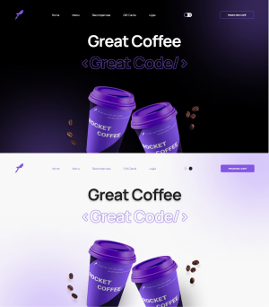

# Rocket Coffee
## Desafio da Rocketseat 

O desafio consiste em codar o layout do figma e deixar responsivo.

Mas como na plataforma também tem ao desafio de fazer um switch theme, então eu juntei todos em 1 e fiz o <strong>light theme<strong>

No momento também estou aprendendo SASS então utilizei ele para estilizar, mesmo que seja algo relativamente simples.

<h2>Resultado</h2>

  <a href="https://rocketcoffeebrta.netlify.app/">Link do site</a>
<ul>
  <h2>Tecnologias que utilizei</h2>
  <li>JavaScript</li>
  <li>SASS</li>
  <li>HTML</li>
  <li>Figma</li>
</ul>
